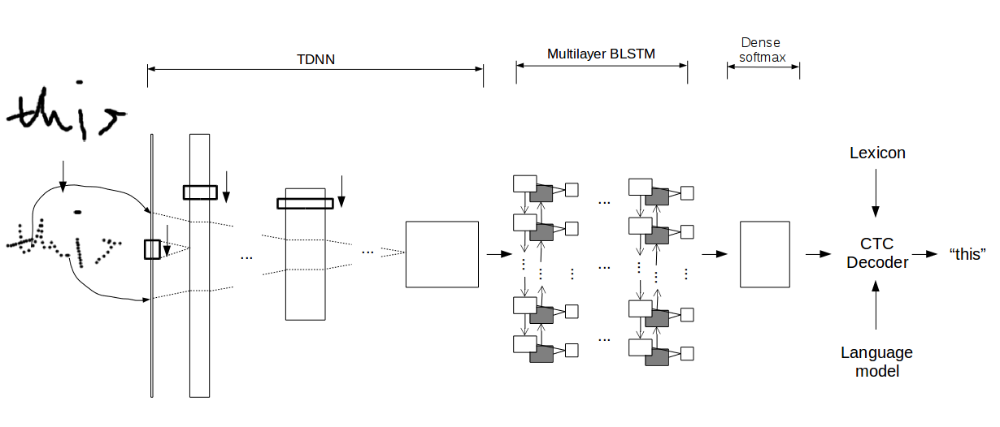

# English on-line handwriting recognition with TDNN and RNN

[IAM database](http://www.fki.inf.unibe.ch/databases/iam-handwriting-database)

6.2% character error rate (CER) on IAM-OnDB independent writer handwriting task 2.

Alongside with the code, we provide:
1. Pretrained weighs for the current iteration of model
2. 100k lexicon from wikitionary or 10k lexicon from google 1b corpus
3. A heavily pruned 5-gram character level language model trained on a subset of google 1b corpus.
4. Example data from IAM Online database.

Prediction would be slightly worse than the above result due to the pruned language model, but should work okay. Download the data directly from IAM official website shown above if neccessary.

## Network 


## Getting Started

### Installing
Create a virtual environment.

Install dependencies
```
pip install -r requirements.txt

pip install -e .
```
### Run
Demo shows some jupyter notebook examples. Writingpad.py runs the writing pad application.

```
python writingpad.py
```


